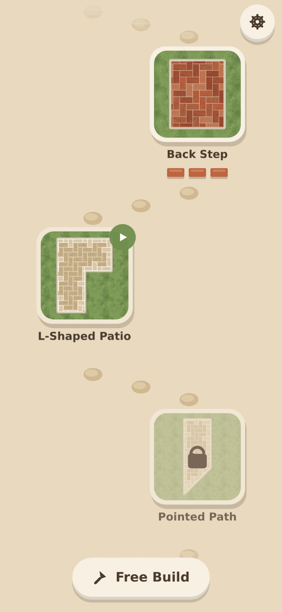
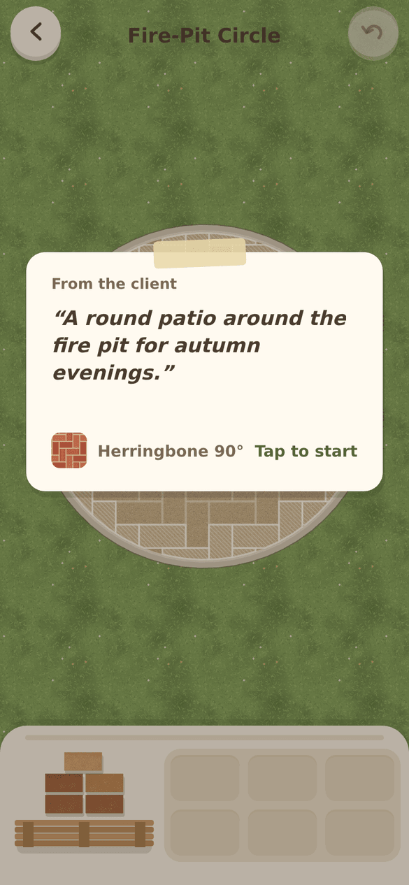
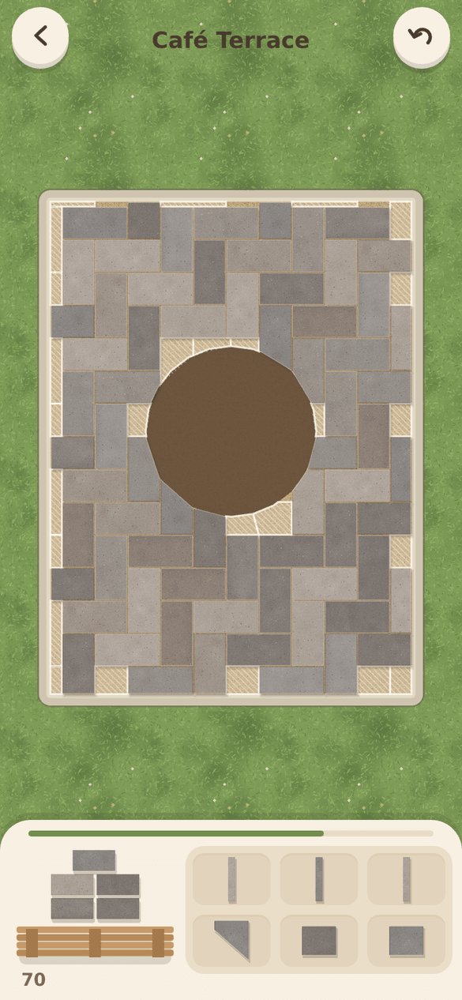
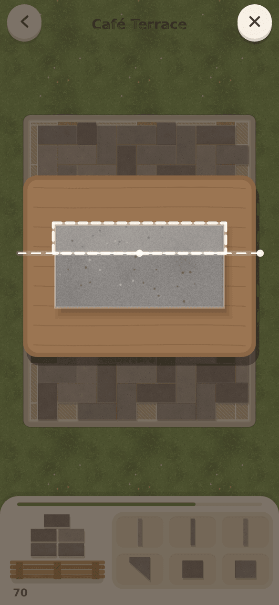
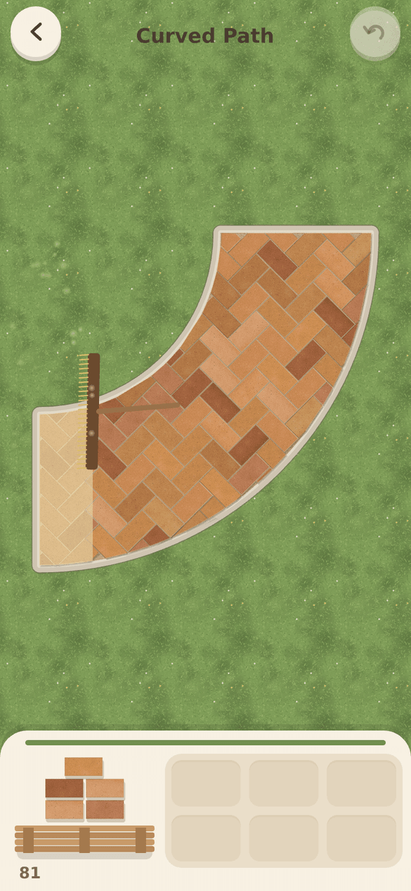
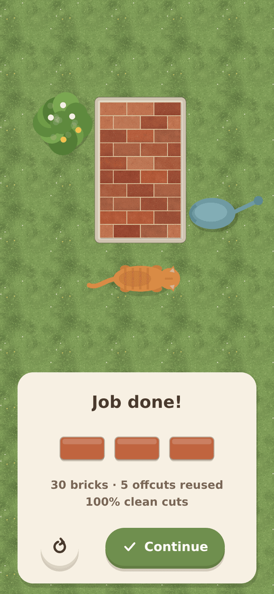
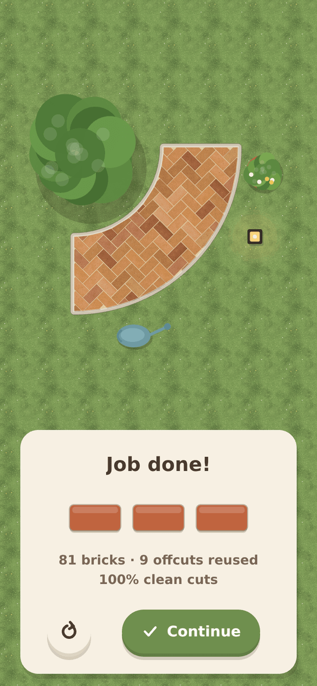
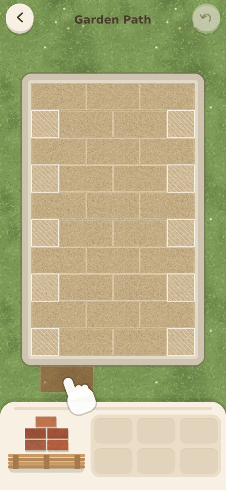
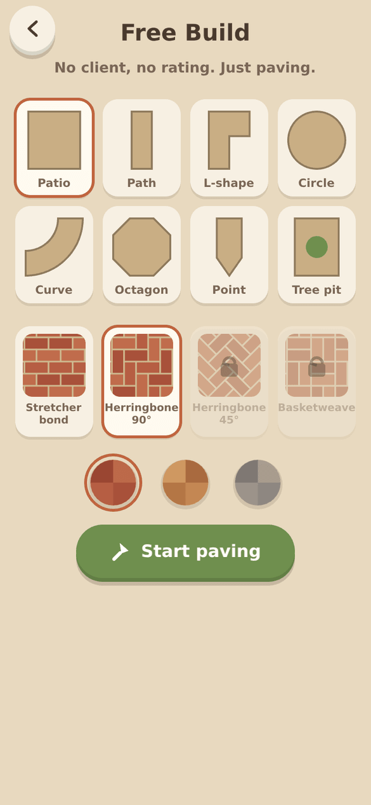
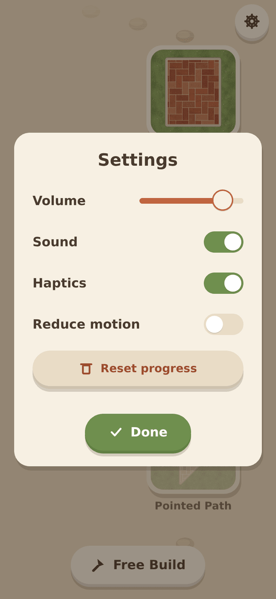

# Herringbone

A calm, tactile puzzle game about laying brick patios, paths and driveways, seen from above.

Drag bricks from the pallet and they snap into the pattern. The middle of each job goes quickly.
The puzzle is the edges. Wherever the pattern crosses the border of the job (straight, angled or
curved), a whole brick won't fit. Take it to the splitter, swipe a cut line across it, and the
cut piece drops into the gap. Offcuts go to a small tray and can be turned and reused in other
gaps. When everything is covered, jointing sand is swept in, a plate compactor rumbles over, the
camera pulls back, and the garden fills in around your work.

No timers, no lives, no fail states, no ads. Every job can be finished. A gentle 1 to 3 brick
rating rewards clean cuts and frugal use of material.

| Map                                 | Client note                                  | Paving                                    | Splitter                                      |
| ----------------------------------- | -------------------------------------------- | ----------------------------------------- | --------------------------------------------- |
|  |  |  |  |

| Sand sweep                                   | Finished                                      | Rating                                    | Tutorial                                      |
| -------------------------------------------- | --------------------------------------------- | ----------------------------------------- | --------------------------------------------- |
|  |  |  |  |

| Free Build                                        | Settings                                      |
| ------------------------------------------------- | --------------------------------------------- |
|  |  |

## What's in it

- 13 handcrafted jobs in 3 neighborhoods: Maple Row, Willow Lane and Harbour Hill. They include
  a straight garden path, an L-shaped patio, a path with a 45° end, a round fire-pit patio, a
  curved path, a café terrace around a tree and a seafront promenade with a wavy edge.
- Four patterns: stretcher bond (the tutorial), 90° herringbone, 45° herringbone and
  basketweave. Each neighborhood unlocks one new pattern.
- A neighborhood map with thumbnails rendered from the real levels. Finished jobs show your own
  bricks, and you can tap one to look at it again.
- A wordless ghost-hand tutorial in the first job, Free Build mode, and settings for volume,
  sound, haptics, reduce motion and reset.
- No image or audio files. Every texture (bricks, sand, grass), decoration, icon and sound is
  generated in code.

## Herringbone 3D: first-person freeplay

A separate first-person 3D game shares the paving maths. You kneel on an endless, gently winding
garden path and lay charcoal blocks in 45° herringbone with orange-gloved hands. Pick up blocks
from the packs beside the path, tap the sand bed to lay them (hold and sweep to keep laying),
mark the gaps at the kerb, cut those blocks on a wheeled block splitter, and lay the cut pieces.
There's no end and no score, just a count of blocks laid and square metres paved. The path
streams in 4 m chunks, and progress saves in the browser.

```sh
pnpm dev:3d         # http://localhost:5174
pnpm build:3d       # static bundle in dist-paver/
```

Desktop: WASD to walk, mouse to look (pointer lock when allowed, drag otherwise), click to act,
C to kneel or stand. Phones: left thumb walks, right thumb drags to look, tap to act, press and
hold then drag to sweep. Add `?quality=low|high` to override graphics, or `?shadows=0` to turn
shadows off.

It's built with Three.js: procedural canvas textures and normal maps, a physical sky with image-based
light, sun shadows that follow the player, instanced blocks with chamfered geometry up close and
boxes further away, and Web Audio sounds. The code is in `src/paver/`. `path.ts` and `slots.ts`
are pure and unit-tested in `tests/unit/paver.test.ts`, and `e2e/paver.spec.ts` plays the full
pick-up, lay, mark, cut and lay loop.

## Run it in a browser

Requirements: Node 22+ and pnpm 10+.

```sh
pnpm install
pnpm dev            # http://localhost:5173. Use your browser's phone emulation (e.g. 390x844).
```

Touch is the main input; a mouse works too. Useful URL parameters for development:

| Parameter                 | Effect                                                            |
| ------------------------- | ----------------------------------------------------------------- |
| `?level=harbour-2`        | Jump straight into a job (skips the client note and the tutorial) |
| `&review=1`               | Show that job finished                                            |
| `&note=1` / `&tutorial=1` | Show the client note / tutorial on a deep link                    |
| `?scene=freebuild`        | Open Free Build                                                   |
| `?safe=59,34`             | Simulate a notch and home indicator (top and bottom insets in px) |

## Tests and checks

```sh
pnpm typecheck      # TypeScript, strict
pnpm lint           # ESLint (also enforces that src/core stays free of PixiJS and the DOM)
pnpm format:check   # Prettier
pnpm test           # Vitest: geometry, patterns, slots, cutting, offcuts, scoring, saves, levels
pnpm build          # production web bundle in dist/
pnpm e2e            # Playwright at 390x844 (builds must exist: run pnpm build first)
```

The unit tests prove that every level can be finished. A simple solver lays whole bricks,
makes ideal straight cuts from the target shapes and reuses offcuts, and every edge piece must
come out clean. The Playwright suite drives real pointer input (drag, tap, swipe cuts, offcut
drags, undo). It plays through map, note, tutorial, finish, save and reload, checks settings
persistence and Free Build, and loads and solves all 13 levels in the real scene.

To regenerate the screenshots in `docs/screenshots/`:

```sh
pnpm build && SCREENSHOTS=1 pnpm e2e e2e/screenshots.spec.ts
```

CI (`.github/workflows/ci.yml`) runs install, typecheck, lint, format check, unit tests, build and
the Playwright tests on every push.

## Project layout

```
src/core/       Pure game logic. No PixiJS, no DOM; fully unit-tested.
  geom.ts         polygons, Clipper2 boolean ops, half-plane clipping, hulls, insets
  patterns.ts     tilings: stretcher, herringbone 90/45, basketweave
  job.ts          level -> slots (full / edge), sliver rule, concave-target splitting
  cut.ts          splitter cuts, accuracy (IoU), ideal cuts
  offcut.ts       offcut tray and rotate/flip fit check
  game.ts         game state, cut sessions, unlimited undo
  scoring.ts      1-3 brick rating;  solver.ts  greedy solver;  save.ts  versioned saves
  level.ts        level schema + validating loader;  progress.ts  unlocks;  freebuild.ts
src/levels/     Level JSON (generated by scripts/build-levels.mjs) + index.json
src/view/       PixiJS rendering and scenes (map, job, splitter, finish, tutorial, ...)
src/audio/      Web Audio synthesis for every sound
src/platform/   Haptics and storage interfaces (Capacitor on device, web fallbacks)
scripts/        level builder, icon/splash generator
ios/ android/   Capacitor native projects
```

### Editing levels

Levels are data. Edit `scripts/build-levels.mjs` (it samples curves into points) and run
`pnpm levels`, or edit the JSON in `src/levels/` directly. Each level has an id, name, client
note, border polygon (with optional holes), pattern type and offset, brick size, brick colours
and decorations. `pnpm test` validates every level and checks it can be finished.

## Building for iPhone (Xcode on a Mac)

Requirements: macOS with Xcode 16 or newer, Node 22+, pnpm 10+, and an Apple ID (a free one
works for your own device).

```sh
pnpm install
pnpm build && npx cap sync ios     # copies dist/ into the iOS project
npx cap open ios                   # opens ios/App/App.xcodeproj in Xcode
```

In Xcode:

1. Select the **App** target, then **Signing & Capabilities**, and choose your Team. If the
   bundle id `com.alphahylian.herringbone` is taken on your account, change it to something
   unique.
2. Plug in your iPhone, unlock it and pick it as the run destination. On the phone, enable
   **Settings > Privacy & Security > Developer Mode** if asked.
3. Press **Run** (⌘R). The first time, trust the developer certificate on the phone under
   **Settings > General > VPN & Device Management**.

The app is portrait-only, shows dark status-bar text on the sand background, and uses the
generated icon and splash. Capacitor 8 uses Swift Package Manager, so there's no CocoaPods
step.

## Building for Android (Android Studio)

Requirements: Android Studio (Ladybug or newer) with an Android SDK, JDK 21 (bundled with
Android Studio), Node 22+, pnpm 10+.

```sh
pnpm install
pnpm build && npx cap sync android
npx cap open android               # opens the android/ project in Android Studio
```

In Android Studio, let Gradle sync finish. On your phone, enable **Developer options >
USB debugging**, plug it in and press **Run**. For a command-line debug build:

```sh
cd android && ./gradlew assembleDebug   # APK in android/app/build/outputs/apk/debug/
```

## Icons and splash screens

`pnpm icons` renders the app icon (a herringbone tile) and the light and dark splash screens to
`assets/` with an SVG-to-PNG script. It then runs `@capacitor/assets` to generate every iOS and
Android size. Run `npx cap sync` afterwards.

## Tech

TypeScript (strict), Vite, pnpm, PixiJS v8, Capacitor 8 (`@capacitor/haptics`,
`@capacitor/preferences`, status bar, splash screen), Clipper2 (`clipper2-ts`) for polygon
boolean operations, Vitest and Playwright. See `DECISIONS.md` for the judgment calls and
`PROGRESS.md` for status and known issues.
